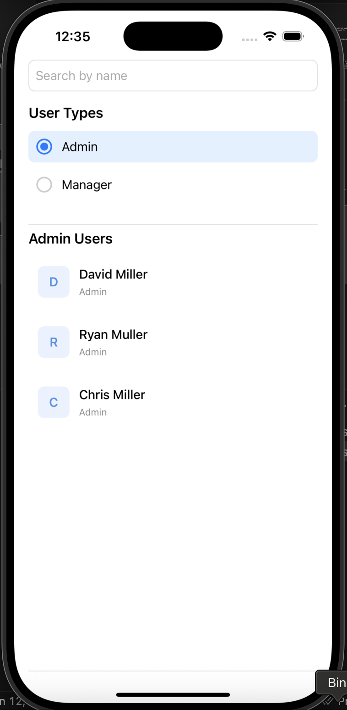

# Zeller Assignment

A React Native application built using TypeScript and GraphQL (via Apollo Client), designed to fetch and display a list of users with filtering by role (`Admin` / `Manager`).

---

## Demo Url of how application works
https://www.loom.com/share/e8f5968613cc4d4aa90e2ebcfd9dfcd8?sid=c7a125ca-5f3c-44a3-b1b6-24b4cc840c6d

## Screen Shot of application



---

## Folder Structure

```
src/
├── Components        # Reusable UI components (e.g., UserCard, Header, etc.)
├── config            # App-level configuration (e.g., constants, themes)
├── graphql           # GraphQL queries, mutations, and types
├── hooks             # Custom React hooks (e.g., useCustomerList)
├── Navigations       # Navigation setup (e.g., stack or tab navigators)
├── Screens           # App screens (e.g., CustomerListScreen)
```

---

##  Features

- **GraphQL Integration** using Apollo Client
- **Role-based Filtering** (`Admin` and `Manager`)
- **Pull-to-Refresh** support via `refetch()`
- **Functional Components** with TypeScript
- **Loading/Error Handling** for queries

---

## Testing

- Uses **Jest** and **React Native Testing Library**
- Mocks GraphQL queries for isolated testing
- Coverage includes hooks and UI components

To run tests:
```bash
yarn test
```

---

## 🛠️ Tech Stack

- React Native `0.80`
- TypeScript
- Apollo Client (GraphQL)
- React Navigation
- Jest & React Native Testing Library

---

## Setup Instructions

1. **Clone the repository**
   ```bash
   git clone <repo-url>
   cd ZellerAssignment
   ```

2. **Install dependencies**
   ```bash
   yarn install
   ```

3. **Run the project**
   ```bash
   npx react-native run-ios   # or run-android
   ```

4. **Start mock server (if applicable)**
   ```bash
   cd mock-server
   yarn start
   ```

---

## 📁 GraphQL Mock Server

If you are using a local mock GraphQL server, ensure it's running before launching the app.

---

## Author

**Vikram Singh**  
React Native Developer | GraphQL Enthusiast
